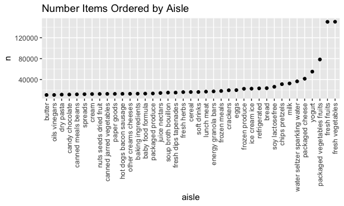
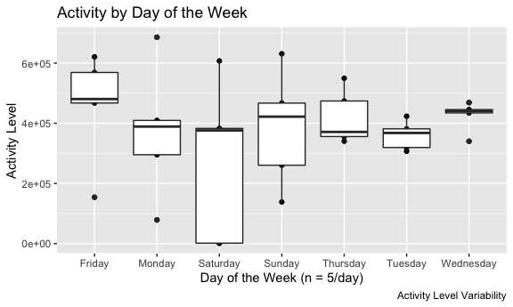
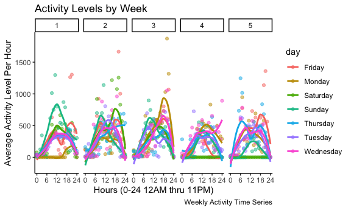
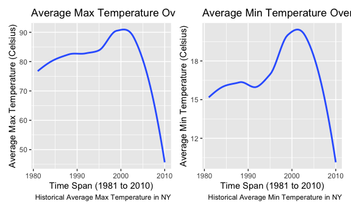

Homework 3
================
Vihar Desu

# Problem 1

The Instacart dataset provides useful information about what their users
order at grocery stores including how frequently or regularly they use
the instacart service to purchase their grocery items. Relevant columns
may include “order\_dow”, “order\_hour\_of\_day”,
“days\_since\_prior\_order”, etc. It also lends itself to analysis of
what product categories that these purchased grocery items fall in with
columns like “aisle” and “department”. This dataset contains 1384617
rows and 15 columns of information. We have information for 131209 of
orders, purchased accross 21 of departments and 134 aisles from 131209
users.

### Instacart Dataset Preview

| order\_id | product\_id | add\_to\_cart\_order | reordered | user\_id | eval\_set | order\_number | order\_dow | order\_hour\_of\_day | days\_since\_prior\_order | product\_name                                 | aisle\_id | department\_id | aisle                | department   |
| --------: | ----------: | -------------------: | --------: | -------: | :-------- | ------------: | ---------: | -------------------: | ------------------------: | :-------------------------------------------- | --------: | -------------: | :------------------- | :----------- |
|         1 |       49302 |                    1 |         1 |   112108 | train     |             4 |          4 |                   10 |                         9 | Bulgarian Yogurt                              |       120 |             16 | yogurt               | dairy eggs   |
|         1 |       11109 |                    2 |         1 |   112108 | train     |             4 |          4 |                   10 |                         9 | Organic 4% Milk Fat Whole Milk Cottage Cheese |       108 |             16 | other creams cheeses | dairy eggs   |
|         1 |       10246 |                    3 |         0 |   112108 | train     |             4 |          4 |                   10 |                         9 | Organic Celery Hearts                         |        83 |              4 | fresh vegetables     | produce      |
|         1 |       49683 |                    4 |         0 |   112108 | train     |             4 |          4 |                   10 |                         9 | Cucumber Kirby                                |        83 |              4 | fresh vegetables     | produce      |
|         1 |       43633 |                    5 |         1 |   112108 | train     |             4 |          4 |                   10 |                         9 | Lightly Smoked Sardines in Olive Oil          |        95 |             15 | canned meat seafood  | canned goods |
|         1 |       13176 |                    6 |         0 |   112108 | train     |             4 |          4 |                   10 |                         9 | Bag of Organic Bananas                        |        24 |              4 | fresh fruits         | produce      |

Source: Instacart

### Aisles

``` r
aisles = instacart %>%
  count(aisle) %>% 
  arrange(desc(n))
```

| aisle                         |      n |
| :---------------------------- | -----: |
| fresh vegetables              | 150609 |
| fresh fruits                  | 150473 |
| packaged vegetables fruits    |  78493 |
| yogurt                        |  55240 |
| packaged cheese               |  41699 |
| water seltzer sparkling water |  36617 |

Source: Instacart

There are 134 distinct aisles, with the most popular category being
fresh vegetables appearing 150,609 times in orders. Fresh fruits are a
close second appearing 150,473 times in orders.

### Number of Orders by Aisle

``` r
instacart %>%
  count(aisle) %>% 
  filter(n > 10000) %>% 
  mutate(
    aisle = factor(aisle),
    aisle = fct_reorder(aisle, n)
  ) %>% 
  ggplot(aes(x = aisle, y = n)) + 
  geom_point() +
  ggtitle("Number Items Ordered by Aisle") +
  theme(axis.text.x = element_text(angle = 90, vjust = 0.5, hjust=1))
```



As we can see in the graph above, two most popular categories by far are
the fresh fruits and fresh vegetables. The other popular categories
include such items as milk, yogurt and sparkling water. In general
though, most aisles do trend toward the same amount of ordered items
well below 40,000 in total.

### Baking Ingredients, Dog Food Care and Packaged Vegtables/Fruits

As we can see, the most popular items in each category are light brown
sugar, snack sticks chicken, and organic baby spinach. The number of
ordered items differs largely across these three categories, indicating
that packaged vegetables and fruits are widely more popular than all of
the ranked items combined in this table).

``` r
ranked_table = 
  instacart %>% 
    filter(aisle %in% c("baking ingredients", "dog food care", "packaged vegetables fruits")) %>% 
    group_by(aisle) %>% 
    count(product_name) %>% 
    mutate(rank = min_rank(desc(n))) %>% 
    filter(rank < 4) %>% 
    arrange(aisle, rank)
```

### Product Popularity by Aisle

| aisle                      | product\_name                                 |    n | rank |
| :------------------------- | :-------------------------------------------- | ---: | ---: |
| baking ingredients         | Light Brown Sugar                             |  499 |    1 |
| baking ingredients         | Pure Baking Soda                              |  387 |    2 |
| baking ingredients         | Cane Sugar                                    |  336 |    3 |
| dog food care              | Snack Sticks Chicken & Rice Recipe Dog Treats |   30 |    1 |
| dog food care              | Organix Chicken & Brown Rice Recipe           |   28 |    2 |
| dog food care              | Small Dog Biscuits                            |   26 |    3 |
| packaged vegetables fruits | Organic Baby Spinach                          | 9784 |    1 |
| packaged vegetables fruits | Organic Raspberries                           | 5546 |    2 |
| packaged vegetables fruits | Organic Blueberries                           | 4966 |    3 |

Source: Instacart

### Pink Lady Apples and Coffee Ice Cream

``` r
top =
  instacart %>%
  filter(product_name %in% c("Pink Lady Apples", "Coffee Ice Cream")) %>%
  group_by(product_name, order_dow) %>%
  summarize(mean_hour = mean(order_hour_of_day)) %>%
  mutate(mean_hour = paste0(as.character(floor(mean_hour)), ":", as.character(floor((mean_hour - floor(mean_hour)) * 60
  )))) %>%
  pivot_wider(names_from = order_dow,
              values_from = mean_hour) %>%
  rename(
    c(
      "Product Name" = "product_name",
      "Sunday" = "0",
      "Monday" = "1",
      "Tuesday" = "2",
      "Wednesday" = "3",
      "Thursday" = "4",
      "Friday" = "5",
      "Saturday" = "6"
    )
  )
```

### Time of Purchase Comparison

| Product Name     | Sunday | Monday | Tuesday | Wednesday | Thursday | Friday | Saturday |
| :--------------- | :----- | :----- | :------ | :-------- | :------- | :----- | :------- |
| Coffee Ice Cream | 13:46  | 14:18  | 15:22   | 15:19     | 15:13    | 12:15  | 13:50    |
| Pink Lady Apples | 13:26  | 11:21  | 11:42   | 14:15     | 11:33    | 12:47  | 11:56    |

Source: Instacart

# Problem 2

### Accel Dataset Preview

``` r
accel_data = 
  read_csv("./data/accel_data.csv") %>% 
  janitor::clean_names() %>% 
  pivot_longer(
    activity_1:activity_1440,
    names_to = "activity_minute",
    names_prefix = "activity_",
    values_to = "activity_level"
  ) %>% 
  mutate(
    weekday = case_when(
      day == "Monday" | day == "Tuesday" | day == "Wednesday" | day == "Thursday" | day == "Friday" ~ TRUE,
      day == "Saturday" | day =="Sunday" ~ FALSE
    )
  ) %>% 
  select(
    day_id,
    week_id = week,
    weekday,
    day,
    minute = activity_minute,
    everything()
  )
```

| day\_id | week\_id | weekday | day    | minute | activity\_level |
| ------: | -------: | :------ | :----- | :----- | --------------: |
|       1 |        1 | TRUE    | Friday | 1      |        88.37778 |
|       1 |        1 | TRUE    | Friday | 2      |        82.24444 |
|       1 |        1 | TRUE    | Friday | 3      |        64.44444 |
|       1 |        1 | TRUE    | Friday | 4      |        70.04444 |
|       1 |        1 | TRUE    | Friday | 5      |        75.04444 |
|       1 |        1 | TRUE    | Friday | 6      |        66.26667 |

Source: Columbia Medical Center

This dataset contains five weeks of accelerometer data collected on a 63
year-old male with BMI 25, who was admitted to the Advanced Cardiac Care
Center of Columbia University Medical Center and diagnosed with
congestive heart failure (CHF). This dataset contains activity level
data of this male on one minute intervals for all 5 weeks that his
experiment was conducted. There are 50400 rows of data, which represent
entries for “activity\_level” temporally categorized by columns
“day\_id”, “week\_id”, “weekday”, “day” and “minute”.

``` r
accel_data_totals = 
  accel_data %>% 
  group_by(day_id, week_id, day, weekday) %>% 
  summarize(activity_total = sum(activity_level)) %>% 
  arrange(desc(activity_total))

week_plot = 
  accel_data_totals %>% 
  ggplot(aes(x = day, y = activity_total)) + 
  geom_point() +
  geom_boxplot() +
  labs(
    title = "Activity by Day of the Week",
    x = "Day of the Week (n = 5/day)",
    y = "Activity Level",
    caption = "Activity Level Variability"
  )

week_plot
```



From the results of the graph, we can see that there is an observable
difference in this individual’s activity variability on Saturdays.
Monday’s tended to be the high activity level day, while on average the
individual tended to have an activity level around 4e+05. What’s also
consistent is that the individual’s activity level mirrored a sort of
wave like plot, around his average activity level over time.

``` r
daily_plot = 
  accel_data_totals %>% 
  ggplot(aes(x = day_id, y = activity_total)) + 
  geom_point() +
  geom_smooth(se = FALSE) +
  labs(
    title = "Activity throughout Study Interval",
    x = "Days of Study (n = 35)",
    y = "Activity Level",
    caption = "Activity Level Over Time"
  )

daily_plot
```


``` r
weekly_activity_level_plot = 
  accel_data %>% 
  mutate(
    hour = floor(as.integer(minute) / 60)
  ) %>% 
  group_by(day_id, week_id, day, hour) %>% 
  summarize(average_activity_level_per_hour = mean(activity_level)) %>% 
  ggplot(aes(x = hour, y = average_activity_level_per_hour, color = day)) + 
  geom_point(aes(color = day), alpha = .5) +
  geom_smooth(se = FALSE) +
  facet_grid(. ~ week_id) +
  labs(
    title = "Activity Levels by Week",
    x = "Hours (0-24 12AM thru 11PM)",
    y = "Average Activity Level Per Hour",
    caption = "Weekly Activity Time Series"
  ) +
  scale_x_continuous(
    breaks=c(0, 6, 12, 18, 24),
    labels = c("0", "6", "12", "18", "24")) +
  theme_classic()

weekly_activity_level_plot
```



The graph above represents the individual’s activity level every day
over the course of the 5-week study. Here, I have faceted the data into
5 graphs representing each week of the study to clearly avoid cluttering
the data. Furthermore, we can observe patterns associated with days of
the week as they are color coded accordingly. To further avoid clutter,
I’ve averaged minute by minute activity streams in hours to flatten the
data in a more accessible format. As we can see from this graph, the
general shapes of this particular individual’s activity levels on a
daily basis follow a somewhat bell-like shape. The individual’s activity
seems to be particularily low on the last two Saturday’s of the study,
and in general he seem’s to consistently peak around noon ech day. Week
2 and Week 3 seem to be high activity weeks for this individual as they
consistently had high activity throughout those weeks not missing any
days like week 1, 4 and 5.

# Problem 3

### NOAA Dataset Preview

``` r
noaa = ny_noaa %>% 
  janitor::clean_names() %>% 
  separate(date, c("year", "month", "day"), "-") %>% 
  rename(
    "prcp_(10-1mm)" = prcp,
    "snow_(mm)" = snow,
    "snwd_(mm)" = snwd
  )
```

This data is from the NOAA National Climatic Data Center, where we have
2595176 entries of precipitation and temperature data from various
weather stations across New York. We have information about the amount
of precipitation in tenths of millimeters labeled as “prcp\_10-1mm”, as
well as data about snowfall and snow depth (both in mm). We also have
information about the minimum and maximum temperatures at various points
in time. The data spans years 1981 to 2010. Given that there are a lot
of data points, this dataset is an ideal candidate for flattening using
the summarize() function.

| id          | year | month | day | prcp\_(10-1mm) | snow\_(mm) | snwd\_(mm) | tmax | tmin |
| :---------- | :--- | :---- | :-- | -------------: | ---------: | ---------: | :--- | :--- |
| US1NYAB0001 | 2007 | 11    | 01  |             NA |         NA |         NA | NA   | NA   |
| US1NYAB0001 | 2007 | 11    | 02  |             NA |         NA |         NA | NA   | NA   |
| US1NYAB0001 | 2007 | 11    | 03  |             NA |         NA |         NA | NA   | NA   |
| US1NYAB0001 | 2007 | 11    | 04  |             NA |         NA |         NA | NA   | NA   |
| US1NYAB0001 | 2007 | 11    | 05  |             NA |         NA |         NA | NA   | NA   |
| US1NYAB0001 | 2007 | 11    | 06  |             NA |         NA |         NA | NA   | NA   |

Source: NOAA

``` r
snowfall = noaa %>% 
  group_by(`snow_(mm)`) %>% 
  summarize(n_obs = n()) %>% 
  arrange(desc(n_obs))
```

As we can see from the table above, the most common observations for
snowfall were either 0 or NA indicating that there was no precipitation
on those days, which makes sense that given in New York City typically
only experiences snow during the winters (a small subset of the data).

### Max Temperatures: January vs. July

``` r
january_v_july =
  noaa %>%
  select(id, year, month, tmax) %>%
  mutate_at(vars(tmax), ~ replace(., is.na(.), 0)) %>%
  filter(month == "01" | month == "07") %>%
  mutate(month = case_when(month == "01" ~ "January",
                           month == "07" ~ "July")) %>%
  mutate(tmax = as.integer(tmax),
         year = as.integer(year)) %>%
  group_by(year, month) %>%
  summarize(tmax_avg = mean(tmax)) %>%
  ggplot(aes(x = year, y = tmax_avg)) +
  geom_point(alpha = .5) +
  geom_smooth(se = FALSE) +
  labs(
    title = "Average Max Temperature Over Time in NY",
    x = "Time Span (1981 to 2010)",
    y = "Average Max Temperature (Celsius)",
    caption = "Historical Average Max Temperature in NY"
  ) +
  facet_grid(. ~ month)

january_v_july
```


In general, it seems like there has been a steady incline in average
temperature in both January and July months roughly between 1980 and
1990. From there, we notice somehwat of a plateau in the average
temperature but some observable variability. While the early years in
January tend to be more tightly bound about the mean, the later months
seem to contain a larger standard deviation, suggesting that temperature
has become more extreme. Furthermore, there is a weird dip between early
2000s thru 2010 for the July average max temperature. This doesn’t seem
to correlate to the plateau in January around the same years. This weird
trend must be further investigated Perhaps these outliers are due to
poor data or some serious developments in climate change that have to
better understood.

### Max and Min Temperatures Over Time

``` r
tmax =
  noaa %>%
  select(id, year, month, tmax) %>%
  mutate_at(vars(tmax), ~ replace(., is.na(.), 0)) %>%
  mutate(tmax = as.integer(tmax),
         year = as.integer(year)) %>%
  group_by(year, month) %>%
  summarize(tmax_avg = mean(tmax)) %>%
  ggplot(aes(x = year, y = tmax_avg)) +
  geom_smooth(se = FALSE) +
  labs(
    title = "Average Max Temperature Over Time",
    x = "Time Span (1981 to 2010)",
    y = "Average Max Temperature (Celsius)",
    caption = "Historical Average Max Temperature in NY"
  )

tmin =
  noaa %>%
  select(id, year, month, tmin) %>%
  mutate_at(vars(tmin), ~ replace(., is.na(.), 0)) %>%
  mutate(tmin = as.integer(tmin),
         year = as.integer(year)) %>%
  group_by(year, month) %>%
  summarize(tmin_avg = mean(tmin)) %>%
  ggplot(aes(x = year, y = tmin_avg)) +
  geom_smooth(se = FALSE) +
  labs(
    title = "Average Min Temperature Over Time",
    x = "Time Span (1981 to 2010)",
    y = "Average Min Temperature (Celsius)",
    caption = "Historical Average Min Temperature in NY"
  )

(tmax + tmin)
```


On first sight, it seems that the average max and min temperatures over
time follow the same historical fluctuations. Although the data itself
is different, for example, the minimum temperature ranges from 5 to 25
degrees celsius, the max temperature is much higher. Interestingly
though, the pattern of a steep decline over the more recent years around
2010 indicate a dramatic change in temperature in NY that must be
further investigated.

``` r
snow = 
  noaa %>% 
  select(id, year, month, day, `snow_(mm)`) %>%
  drop_na(`snow_(mm)`) %>% 
  mutate(
    "snow_(mm)" = as.integer(`snow_(mm)`),
    year = as.integer(year)
  ) %>% 
  filter(
    `snow_(mm)` >= 0 , `snow_(mm)` <= 100
  ) %>% 
  group_by(
    year, month, day
  ) %>% 
  summarize(
    avg_snowfall_per_day = mean(`snow_(mm)`)
  ) %>% 
  ggplot(aes(x = year, y = `avg_snowfall_per_day`)) +
    geom_boxplot(aes(group=year)) +
  labs(
    title = "Average Snowfall in NY Over Time",
    x = "Time Span (1981 to 2010)",
    y = "Average Snowfall (mm)",
    caption = "Historical Snowfall Distribution in NY"
  )
  
snow
```


This graph visually demonstrates the snowfall distribution every year in
NY between 1981 and 2010. In this time period, the NOAA dataset
contained daily snowfall measurements for multiple weather stations of
locations accross New York. To simplify the data and make it more
accessible, the graph takes an average daily snowfall across all weather
stations. As is expected for NY weather, the bulk of data points trend
toward 0 or very low amounts of snow. This is because on a yearly basis,
NY is not known to have know, and the peak snow season occurs in the
winter months. Thus, we can visually see the distribution of points that
extend the third quartile (75th percentile) are most likely
representative of the winter months every year. While there is a large
spread, it appears that there is a sort of undulation of average
snowfall over the course of 30 or so years.
