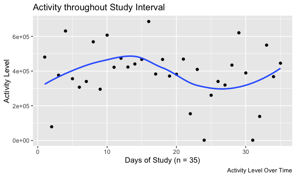
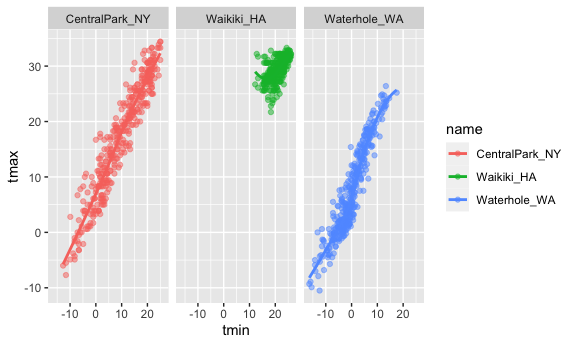
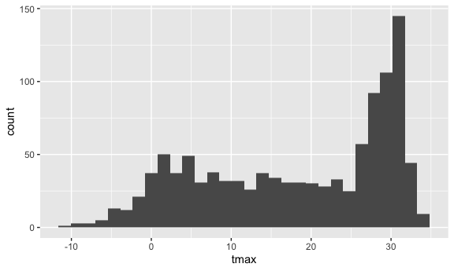

Homework 3
================
Vihar Desu

# Problem 1

The instacart dataset provides useful information about what their users
order at grocery stores including how frequently or regularly they use
the instacart service to purchase their grocery items. Relevant columns
may include “order\_dow”, “order\_hour\_of\_day”,
“days\_since\_prior\_order”, etc. It also lends itself to analysis of
what product categories that these purchased grocery items fall in with
columns like “aisle” and “department”. This dataset contains 1384617
rows and 15 columns of information. We have information for 131209 of
orders, purchased accross 21 of departments and 134 aisles from 131209
users.

### Instacart Dataset

| order\_id | product\_id | add\_to\_cart\_order | reordered | user\_id | eval\_set | order\_number | order\_dow | order\_hour\_of\_day | days\_since\_prior\_order | product\_name                                 | aisle\_id | department\_id | aisle                | department   |
| --------: | ----------: | -------------------: | --------: | -------: | :-------- | ------------: | ---------: | -------------------: | ------------------------: | :-------------------------------------------- | --------: | -------------: | :------------------- | :----------- |
|         1 |       49302 |                    1 |         1 |   112108 | train     |             4 |          4 |                   10 |                         9 | Bulgarian Yogurt                              |       120 |             16 | yogurt               | dairy eggs   |
|         1 |       11109 |                    2 |         1 |   112108 | train     |             4 |          4 |                   10 |                         9 | Organic 4% Milk Fat Whole Milk Cottage Cheese |       108 |             16 | other creams cheeses | dairy eggs   |
|         1 |       10246 |                    3 |         0 |   112108 | train     |             4 |          4 |                   10 |                         9 | Organic Celery Hearts                         |        83 |              4 | fresh vegetables     | produce      |
|         1 |       49683 |                    4 |         0 |   112108 | train     |             4 |          4 |                   10 |                         9 | Cucumber Kirby                                |        83 |              4 | fresh vegetables     | produce      |
|         1 |       43633 |                    5 |         1 |   112108 | train     |             4 |          4 |                   10 |                         9 | Lightly Smoked Sardines in Olive Oil          |        95 |             15 | canned meat seafood  | canned goods |
|         1 |       13176 |                    6 |         0 |   112108 | train     |             4 |          4 |                   10 |                         9 | Bag of Organic Bananas                        |        24 |              4 | fresh fruits         | produce      |

Source: Instacart

### Aisles

``` r
aisles = instacart %>%
  count(aisle) %>% 
  arrange(desc(n))
```

There are 134 distinct aisles, with the most popular category ordered
was fresh vegetables appearing 150,609 times in orders. Fresh fruits are
a close second at 150,473 times in orders.

| aisle                         |      n |
| :---------------------------- | -----: |
| fresh vegetables              | 150609 |
| fresh fruits                  | 150473 |
| packaged vegetables fruits    |  78493 |
| yogurt                        |  55240 |
| packaged cheese               |  41699 |
| water seltzer sparkling water |  36617 |

Source: Instacart

As we can see in the graph above, two most popular categories by far are
the fresh fruits and fresh vegetables. The other popular categories
include such items as milk, yogurt and sparkling water. In general
though, most aisles do trend toward the same amount of ordered items
well below 40,000 in total.

``` r
instacart %>%
  count(aisle) %>% 
  filter(n > 10000) %>% 
  mutate(
    aisle = factor(aisle),
    aisle = fct_reorder(aisle, n)
  ) %>% 
  ggplot(aes(x = aisle, y = n)) + 
  geom_point() +
  ggtitle("Number Items Ordered by Aisle") +
  theme(axis.text.x = element_text(angle = 90, vjust = 0.5, hjust=1))
```



### Baking Ingredients, Dog Food Care and Packaged Vegtables/Fruits

As we can see, the most popular items in each category are light brown
sugar, snack sticks chicken, and organic baby spinach. The number of
ordered items differs largely across these three categories, indicating
that packaged vegetables and fruits are widely more popular than all of
the ranked items combined in this table).

``` r
instacart %>% 
    filter(aisle %in% c("baking ingredients", "dog food care", "packaged vegetables fruits")) %>% 
    group_by(aisle) %>% 
    count(product_name) %>% 
    mutate(rank = min_rank(desc(n))) %>% 
    filter(rank < 4) %>% 
    arrange(aisle, rank) %>% 
    knitr::kable("simple", caption = "Instacart Dataset")
```

| aisle                      | product\_name                                 |    n | rank |
| :------------------------- | :-------------------------------------------- | ---: | ---: |
| baking ingredients         | Light Brown Sugar                             |  499 |    1 |
| baking ingredients         | Pure Baking Soda                              |  387 |    2 |
| baking ingredients         | Cane Sugar                                    |  336 |    3 |
| dog food care              | Snack Sticks Chicken & Rice Recipe Dog Treats |   30 |    1 |
| dog food care              | Organix Chicken & Brown Rice Recipe           |   28 |    2 |
| dog food care              | Small Dog Biscuits                            |   26 |    3 |
| packaged vegetables fruits | Organic Baby Spinach                          | 9784 |    1 |
| packaged vegetables fruits | Organic Raspberries                           | 5546 |    2 |
| packaged vegetables fruits | Organic Blueberries                           | 4966 |    3 |

Instacart Dataset

### Pink Lady Apples and Coffee Ice Cream

``` r
instacart %>% 
  filter(product_name %in% c("Pink Lady Apples", "Coffee Ice Cream") ) %>% 
  group_by(product_name, order_dow) %>% 
  summarize(mean_hour = mean(order_hour_of_day)) %>%
  mutate(
    mean_hour = paste0(as.character(floor(mean_hour)),":",as.character(floor((mean_hour - floor(mean_hour)) * 60)))
  ) %>% 
  pivot_wider(
    names_from = order_dow,
    values_from = mean_hour
  ) %>% 
  rename(c("Product Name" = "product_name", "Sunday"="0", "Monday"="1", "Tuesday"="2", "Wednesday"="3", "Thursday"="4", "Friday"="5", "Saturday"="6")) %>% 
  knitr::kable()
```

    ## `summarise()` regrouping output by 'product_name' (override with `.groups` argument)

| Product Name     | Sunday | Monday | Tuesday | Wednesday | Thursday | Friday | Saturday |
| :--------------- | :----- | :----- | :------ | :-------- | :------- | :----- | :------- |
| Coffee Ice Cream | 13:46  | 14:18  | 15:22   | 15:19     | 15:13    | 12:15  | 13:50    |
| Pink Lady Apples | 13:26  | 11:21  | 11:42   | 14:15     | 11:33    | 12:47  | 11:56    |

``` r
library(ggridges)
weather_df = 
  rnoaa::meteo_pull_monitors(
    c("USW00094728", "USC00519397", "USS0023B17S"),
    var = c("PRCP", "TMIN", "TMAX"), 
    date_min = "2017-01-01",
    date_max = "2017-12-31") %>%
  mutate(
    name = recode(
      id, 
      USW00094728 = "CentralPark_NY", 
      USC00519397 = "Waikiki_HA",
      USS0023B17S = "Waterhole_WA"),
    tmin = tmin / 10,
    tmax = tmax / 10) %>%
  select(name, id, everything())

head(weather_df)
```

    ## # A tibble: 6 x 6
    ##   name           id          date        prcp  tmax  tmin
    ##   <chr>          <chr>       <date>     <dbl> <dbl> <dbl>
    ## 1 CentralPark_NY USW00094728 2017-01-01     0   8.9   4.4
    ## 2 CentralPark_NY USW00094728 2017-01-02    53   5     2.8
    ## 3 CentralPark_NY USW00094728 2017-01-03   147   6.1   3.9
    ## 4 CentralPark_NY USW00094728 2017-01-04     0  11.1   1.1
    ## 5 CentralPark_NY USW00094728 2017-01-05     0   1.1  -2.7
    ## 6 CentralPark_NY USW00094728 2017-01-06    13   0.6  -3.8

``` r
ggplot(weather_df, aes(x = tmin, y = tmax, color = name)) + 
  geom_point(alpha = .5) +
  geom_smooth(se = FALSE) + 
  facet_grid(. ~ name)
```

    ## Warning: Removed 15 rows containing non-finite values (stat_smooth).

    ## Warning: Removed 15 rows containing missing values (geom_point).



``` r
ggplot(weather_df, aes(x = tmax)) + 
  geom_histogram()
```

    ## Warning: Removed 3 rows containing non-finite values (stat_bin).


